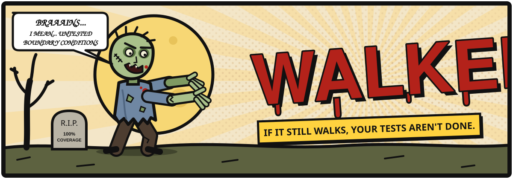

<p align="center">
  
</p>

# 🧟 Walker

> **If it still walks, your tests aren't done.**

Your agent wrote the code.
Your tests passed.
You think you're safe.

**You're not safe.**

Walker is fast, diff-aware mutation verification for AI coding agents. It goes into the code your agent just changed, turns small pieces of it into something *slightly wrong*, and sends that back at your tests. If the tests take it down, good. If it gets back up and keeps walking, there's a hole in your fence.

---

## 🩸 The outbreak

Traditional mutation testing clears the whole map. It asks: *how effective is the test suite for this whole project?*

Walker only checks the part of the fence that was just rebuilt. It asks:

> **Do the tests actually verify the code my coding agent just changed?**

It is built to run inside agentic coding loops: fast, bounded and adversarial. It is not for a repository-wide mutation score.

```text
   Agent changes code
           ↓
         Build
           ↓
         Tests  ✅  "we're fine, right?"
           ↓
   ┌───────────────┐
   │   🧟 WALKER   │  ← reads the Git diff and raises the horde
   └───────────────┘
           ↓
   Targeted mutations
           ↓
     Tests kill them?
       ↙        ↘
    YES          NO
     ↓            ↓
  🔒 SAFE     🧟 IT'S STILL WALKING
                  ↓
         Agent investigates
```

Walker reads the Git diff, mutates only changed production code, sends the most dangerous mutations first, stays inside a time and mutant budget, and reports every survivor to the agent.

---

## 📖 Field glossary

| Survivor slang | What it actually means |
| --- | --- |
| **Horde** | All mutation candidates found in the changed code. |
| **Walker** 🧟 | A mutant that **survived** your tests. Something changed and nobody noticed. |
| **Killed** 🪓 | A test failed with the mutation in place. Headshot. |
| **Hung** 🕸️ | The mutant got your tests stuck (usually an infinite loop) past the hang limit. It got caught in the wire, so it counts as detected. |
| **Safe** 🔒 | Every selected mutant went down. Nothing is still walking. |

The theme stays in the docs and the human-readable output. The APIs, the JSON fields and the exit codes stay plain and technical, so your agent never has to argue with a zombie.

---

## 🎒 Survival kit (quick start)

Install a stable .NET 10 SDK to build and run Walker. Target repositories still
need the SDKs and test runtimes selected by their own projects and `global.json`.
See the [.NET 10 migration and feature review](docs/dotnet-10.md).

```bash
dotnet build Walker.sln
dotnet test Walker.sln

# Run from the target Git repository; use the absolute path to the verifier DLL.
dotnet /path/to/verifier/src/Walker.Cli/bin/Debug/net10.0/Walker.Cli.dll verify \
  --base HEAD~1 \
  --project src/Payments/Payments.csproj \
  --tests tests/Payments.Tests/Payments.Tests.csproj \
  --timeout 60 --max-mutants 20 --format json
```

- Use `--filter "FullyQualifiedName~EpsDebitTests"` to run a focused subset of a slow suite. The same filter applies to the baseline and every mutant; a filter matching no executed tests is an error. JSON echoes the effective scope as `testFilter` (schema version 1). CLI `--filter` overrides the optional `"filter"` in `walker.json`.
- Repeat `--tests` to defend more than one test project.
- `--format text` gives the short field report; `--verbose` adds timings.
- JSON includes a `files` array with each changed production file, its unique changed-line count, and discovered/selected mutant counts. Text reports name files with no candidates. A passing run provides evidence only for selected expressions; files with zero candidates remain unverified.
- JSON always includes timings and uses `schemaVersion: 1`.

### What a bad day looks like

```text
WALKER
Horde: 4 mutation candidates
4 selected for verification
4/4 executed
2 KILLED
2 WALKERS
IT'S STILL WALKING.

WALKER ec444dfa13bb5ea54068
Payments/PaymentService.cs:6
PaymentService.CanPurchase
Original:
    balance >= price
Walker:
    balance > price
Your tests did not detect this behavioural change. Investigate the missing behavioural constraint.
...
Completed in 8.3s
If it still walks, your tests aren't done.
```

Not one test checked a purchase where the balance is *exactly* equal to the price. That boundary is unguarded, and a walker went straight through it.

### 🗺️ Teach your agent the rules

The [agent skill](skills/walker-verification/SKILL.md) tells your agent when to run Walker, how to choose scope and how to investigate survivors. Copy its directory into your agent's skills directory (for Codex, `.agents/skills/walker-verification/`), or tell the agent to follow the file.

---

## 🏚️ Setting up camp (local/global tool)

The CLI project is configured as a .NET tool with package ID `Walker.Cli`, title `Walker` and command `walker`. This metadata is provisional. It does not claim that these names are available on public feeds. No package is published; check naming and ownership before any publication.

```bash
dotnet pack src/Walker.Cli -c Release -o artifacts
# In the target repository:
dotnet new tool-manifest # only if there isn't one already
dotnet tool install Walker.Cli --add-source /path/to/verifier/artifacts --version 0.1.0
dotnet tool run walker -- verify --project src/Payments/Payments.csproj \
  --tests tests/Payments.Tests/Payments.Tests.csproj --format json
```

For a global install, use the same trusted local package source with `--global`. The command is then `walker verify`. Do not trust a stranger at the gate: an unrelated public package with the same name is not this implementation.

---

## 🧭 Camp rules (configuration)

Put an optional `walker.json` in the current directory:

```json
{
  "base": "origin/main",
  "project": "src/Payments/Payments.csproj",
  "tests": ["tests/Payments.Tests/Payments.Tests.csproj"],
  "filter": "FullyQualifiedName~PaymentTests",
  "maxMutants": 20,
  "timeoutSeconds": 60,
  "exclude": ["**/*.Designer.cs", "**/Generated/**"]
}
```

CLI arguments override the config. Repeated `--tests`/`--exclude` replace their configured lists. Paths are relative to the current directory; exclusion globs match repository-relative paths. Unknown configuration fields, duplicate settings (including case variants), and unknown CLI options are errors, because nobody gets into camp without being checked.

---

## 🚨 How the night ended (exit codes)

| Exit | Status | Meaning |
| --- | --- | --- |
| 0 | `passed` | 🔒 All selected mutants were killed (or hung, which counts as detected). |
| 1 | `failed` | 🧟 A completed verification has surviving walkers. |
| 2 | `error` | 💥 Discovery, build, test or infrastructure error. The evidence cannot be trusted. |
| 3 | `incomplete` | 🌒 Timeout, cancellation, skips or no eligible expressions. Safety was **not** established. |

Errors take precedence over incomplete execution; incomplete takes precedence over survivors. Check `results` even when a run was incomplete: walkers found before nightfall are still real.

- **Compilation errors are never kills.** A mutant that never compiled was never a threat.
- Killed results include `failingTests` names from TRX (at most 10). Optional `--confirm-kills` (or `"confirmKills": true` in config) reruns only failing test methods, intersected with the original filter in the killing framework. Source and single-worker paths rebuild restored production; isolated workers use their separate, validated ordinary DLL generation. It is off by default and costs extra work inside the same global budget. Parameterized methods can rerun all rows admitted by that filter.
- Experimental `--compiled-tests` (or `"compiledTests": true`) compares project and DLL baseline results before using verified assemblies for full retries after preferred tests. It preserves the original filter, framework, output directory and fresh test host. Custom targets/settings and incomplete output metadata keep project execution. The extra probes and output checks can make a run slower; this option is off by default. See the [mutation optimisation plan](docs/mutation-optimisation-plan.md).
- Experimental `--mutant-mode switch` (or `"mutantMode": "switch"`) prepares selected built-in numeric boundary mutations in an isolated copy, checks the complete baseline again, and activates one mutation per fresh test process. Unsupported syntax or project layouts use source mutation. JSON reports preparation time and switched/fallback counts. Source mode remains the default; preparation may outweigh savings for small diffs. Use this separately from `--compiled-tests`.
- Experimental `--workers 2` (or `"workers": 2`) overlaps eligible switch attempts using independent output/content copies, working directories, temp and results paths. It requires switch mode; the default is one worker. Both ordinary and inactive prepared baselines must pass concurrently with matching test identities. Fewer than two eligible mutants or failed parallel preparation retain one worker. Source fallback runs serially after active workers finish. JSON reports `workersRequested` and `workersUsed`; preparation includes copying and validation. Use only with tests whose databases, ports and other external resources support concurrent runs. Worker kill confirmation uses its independently validated, ordinary unmutated DLL in the actual failing framework.
- A repeat failure on unmutated source becomes `TestError`, with `killConfirmed: false`; passing confirmation retains `Killed` with `killConfirmed: true`. `confirmationMs` records its cost. Missing/unsupported identities or more than 10 failures cannot be safely confirmed and yield `TestError`; confirmation cancellation yields `TimedOut`. One confirmation reduces false kills but cannot prove tests are never flaky.
- Test failures come from TRX counters, not from a generic nonzero exit code.
- A run with no executed tests is an error. An empty camp is not a defended camp.
- A run with no eligible changed expressions is `incomplete`. No horde means no evidence.

---

## 🔦 How Walker hunts

### Tracking (Git discovery)

- Uses the merge base (`git diff <base>...HEAD` semantics) and compares it with the actual tracked working copy, so staged and unstaged edits have correct line numbers.
- One diff covers every file, and rename detection is on: a renamed file only exposes the lines that really changed.
- Untracked source files are not discovered.
- Deleted-only lines do not authorize mutation of unchanged neighbouring expressions.
- MSBuild Compile-item evaluation limits candidates to the configured production project, including linked source.
- Generated files, test projects, `bin`/`obj`, Designer files and source-generator output are excluded. Walker does not waste arrows on corpses.

### Raising the horde (Roslyn discovery)

- Mutates boundary, equality, boolean, logical, null-pattern and numeric arithmetic expressions, plus boolean constant returns, **only** where they intersect changed lines.
- Changed `if`/`while` and ternary conditions can be negated (`cond` → `!(cond)`). Boolean expression bodies and return expressions (including calls such as `string.Equals`) are negated only when Roslyn resolves their type to `bool`; unresolved expressions are counted in `unresolvedBoolean`. Non-null patterns are negated only when they bind no variables.
- Overlapping candidates keep the highest-priority operator, then the smallest expression. A condition already covered by an operator mutation does not also get broad negation. Pattern/out-variable bindings are conservatively skipped for negation to preserve definite assignment.
- Arithmetic needs known numeric operand types. All changed files share one compilation together with the project's other Compile items and the SDK implicit usings. Operands that still cannot be resolved (for example package types) are skipped and counted in `unresolvedArithmetic`.
- Invocation removal, numeric return constants, coverage-based selection and equivalent-mutant detection are not implemented yet.
- Unusual operator overloads or project context can still produce a compile error. Such results never pass verification.

### Choosing targets (selection)

- The most dangerous first: boundary, equality, null handling, boolean logic, returns, then arithmetic. After that, repository path, location and ID.
- Selection rotates across (file, operator) groups, so one dense file cannot take the whole budget.
- `--max-mutants` limits **selected** mutants. Candidates that are not selected count as discovered, not as skipped.

### Before dark (budgets and timeouts)

- The `--timeout` budget covers discovery, baseline and execution. When it runs out, no new mutants start, the running process tree is stopped and source cleanup finishes. Cleanup can go slightly past the budget.
- If the budget expires during the baseline, `baselineMs` records the elapsed work, no mutant starts, and skipped results identify the unfinished baseline. The report suggests `--filter` or a larger `--timeout`; this is exit 3, never a pass. Baseline failures also retain their elapsed timing and remain exit 2.
- Each mutant also has a **hang limit** of 3× the baseline test-project build and test time plus 5 seconds. A mutant that goes past it (for example an infinite loop) is `Hung`: it counts as detected and the hunt continues. Only the global budget makes a run incomplete.

### Fighting (execution)

- The baseline build and tests run once before any mutation. A test that was already failing must never count as a kill.
- Mutant tests rebuild the affected graph with `dotnet test --no-restore`. Projects and verified target frameworks run in sequence, stopping at the first confirmed test failure. Survivors must pass the full requested scope on every framework.
- For slower suites, methods that killed earlier mutants run first, intersected with the original filter. Each preferred group must first pass on restored, unmutated source. Passing preferred tests always falls back to the full requested scope, reusing the freshly built mutated assemblies. Quick suites avoid the extra test-host startup.
- Baseline build metadata can prove that a compatible test-project build already includes production, including SDK-resolved transitive references in multi-target test projects; Walker then skips the separate production build. Multi-target production, runtime-specific, customized or unconfirmed references keep the separate build. Unknown framework metadata or baseline frameworks without executed tests retain the combined test invocation.
- If a mutant run fails without results, a production-only build separates `CompileError` from `TestError`.
- Analyzers do not run in Walker's builds (`-p:RunAnalyzers=false`) because they do not change behaviour. Source generators still run.

### Burying the bodies (source restoration)

- Walker snapshots the exact working-copy bytes (BOM, newlines and your own uncommitted edits) and restores them in `finally`. It refuses to apply a mutation to source that changed after discovery.
- **If Walker is killed while a mutation is applied**, a restore journal (`.git/walker-restore.json`, or the temporary directory when `.git` is not a directory) lets the next run restore the original bytes before discovery. Walker refuses to overwrite a file that changed after the interruption, and tells you what to inspect.
- Run one verifier per working tree and do not edit target files while it runs. Graceful Ctrl+C is supported. Build outputs can still contain the last mutant until a normal rebuild; the source is always restored.

---

## 🧠 When a walker gets through

**Don't panic. Don't start swinging at production code.**

A surviving walker can mean:

1. Missing test coverage.
2. A weak assertion.
3. An untested boundary condition.
4. An equivalent mutation (it only *looks* like a walker).
5. Intentionally unspecified behaviour.
6. Incorrect production behaviour.

The agent must find out which one it is. A surviving walker does **not** necessarily mean production code should change. **Never tell the agent simply to "kill the mutant".** That is how good code gets hurt. Record accepted or equivalent survivors outside Walker with their ID and rationale. V1 does not silently suppress them or change their exit code to success.

---

## 🏰 The camp (architecture)

| Building | Job |
| --- | --- |
| `Walker.Core` | Typed contracts, orchestration, deterministic selection, budgets and statuses. No Roslyn, Git or process dependencies. |
| `Walker.Git` | Change discovery and default exclusions. The lookouts. |
| `Walker.Roslyn` | Changed-expression syntax analysis and stable mutation IDs. Raises the horde. |
| `Walker.Execution` | Process lifecycle, MSBuild source scope, baseline, reversible execution and the restore journal. The front line. |
| `Walker.Cli` | Configuration, arguments, JSON/text reports and tool packaging. The radio. |
| `tests/Walker.Tests` | Discovery, selection, statuses, real Git discovery, renames, process cancellation, hang detection, crash recovery, restoration and a real CLI workflow. |

The integration test builds an isolated Git repository. Changing `balance > price` to `balance >= price` lets a walker through with weak tests (exit 1). A new equality test then kills it (exit 0). Both runs must restore the dirty source byte for byte.

## ⏱️ How fast can you run?

The [performance review](docs/performance.md) records measured costs and optimizations. The [benchmark script](scripts/benchmark.py) runs the example against this verifier and Stryker.NET in a temporary repository. It records wall time, executed mutants and survivors. Results apply to that change and fixture only; they are not a general speed claim. See the [benchmark guidance](docs/benchmark.md).

Every PR runs a Release build/test check and a performance comparison against its
base commit. Open the **Performance comparison** Actions summary for
BenchmarkDotNet timings, allocations and end-to-end speed changes; download the
attached artifact for full reports. Timing changes are informational because hosted
runner noise can outweigh small improvements.

---

<sub>Walker is a tribute to zombie fiction and is not affiliated with *The Walking Dead* or its owners. No tests were harmed. Several were found to be dead inside.</sub>
